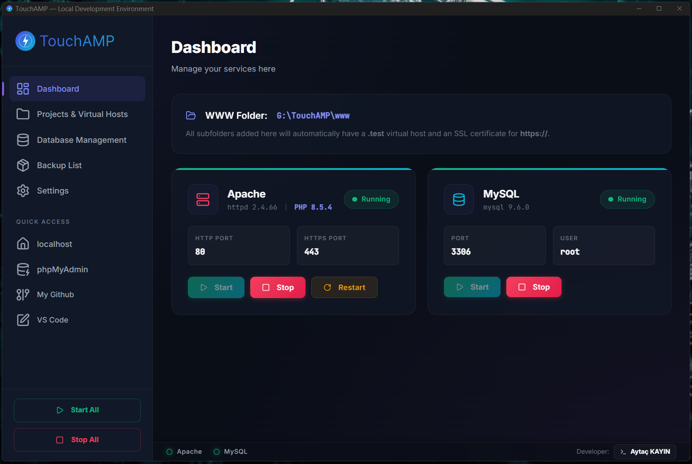

# 🚀 TouchAMP — Premium Yerel Geliştirme Ortamı

TouchAMP, Node.js ve Electron ile geliştirilmiş; yüksek performanslı, taşınabilir (portable) ve görsel olarak büyüleyici bir yerel geliştirme ortamıdır (WAMP alternatifi). Geliştiricilerin Apache, PHP ve MySQL servislerini zahmetsizce yönetmelerini ve yerel web projeleri için "tek tıkla" kurulum deneyimi yaşamalarını sağlar.

---

## ✨ Temel Özellikler

- **🚀 Taşınabilir (Portable) & Hafif**: Herhangi bir klasörden veya USB bellekten çalıştırın.
- **🛠️ Servis Yönetimi**: Apache, PHP ve MySQL için tek tıkla kontrol.
- **🌐 Otomatik Sanal Sunucular (Virtual Hosts)**: `www/` klasörü içindeki tüm alt klasörler için otomatik `.test` domainleri oluşturur.
- **🔒 Otomatik SSL (HTTPS)**: Yerel siteleriniz için SSL sertifikası üretir ve yapılandırır.
- **🔄 Akıllı Çoklu-PHP Desteği**: PHP versiyonları arasında hızla geçiş yapın ve eklentileri (extensions) yönetin.
- **📦 Yedekleme Sistemi**: Entegre SQL ve dosya yedekleme/aktarma sistemi (Yüksek hızlı ZIP sıkıştırmalı).
- **⚡ Hızlı Erişim (Quick Access)**: localhost, phpMyAdmin ve kendi eklediğiniz linklere, klasörlere veya programlara tek tıkla ulaşın.
- **⏰ Zamanlanmış Görevler**: Veritabanı yedekleme veya özel betikler (Node, PHP, Batch) için yerleşik görev yöneticisi.
- **📂 {APP} Dinamik Yolu**: Klasör yollarında `{APP}` değişkenini kullanarak yapılandırmanızı tamamen taşınabilir hale getirin.
- **🛡️ Yönetici Yetkisi (UAC)**: Sistem `hosts` dosyası ve servis yönetimi için gerekli yetkileri otomatik olarak talep eder.
- **📡 Sistem Tepsisi (Tray) Entegrasyonu**: Windows görev çubuğundan anlık durum takibi ve hız kontroller.
- **🌍 Çoklu Dil Desteği**: Türkçe ve İngilizce dilleri arasında hızlı geçiş.
- **💻 Premium UI/UX**: Karanlık mod (Dark mode), glassmorphism ve Lucide/Inter ile sağlanan pürüzsüz animasyonlar.

---

## 🛠️ Teknolojiler

- **Frontend**: Vanilla JavaScript (ES6+), CSS3 (Modern Glassmorphism), Lucide Icons.
- **Backend**: Node.js, Express (API), Child Process (Servis Yönetimi).
- **Desktop**: Electron (Native Window & Single Instance).
- **Yardımcı Araçlar**: `openssl` (SSL üretimi), `bash` (CLI araçları).

---

## 🚀 Başlangıç

### 1. Gereksinimler
- **Node.js**: v18.0 veya üzeri tavsiye edilir.
- **Windows**: (Windows 10/11 için optimize edilmiştir).

### 2. Kurulum (Geliştirmek için)
Depoyu yerel bilgisayarınıza clone'layın:
```bash
git clone https://github.com/aytackayin/TouchAMP.git
cd TouchAMP
npm install
```

### 3. Uygulamayı Başlatma
Geliştirme modunda başlatmak için:
```bash
npm start
```
Veya hazır batch betiğini kullanın:
- **`start.bat`**: (**Yönetici olarak çalıştırın**) Gerekli bağımlılıkları kontrol b eder, eksikse kurar ve sunucuyu başlatır.

---

## 🛠️ Klasör Yapısı ve Önemli Dosyalar

- **`/www`**: Yerel projelerinizi (web sitelerinizi) buraya ekleyin.
- **`/bin`**: Apache, PHP ve MySQL ikili dosyalarını (binaries) içerir.
- **`/data`**: MySQL veri klasörleri (her versiyon için ayrı depolanır).
- **`/lang`**: Dil dosyalarını (i18n) içerir.
- **`start.bat`**: Uygulamayı başlatmak için ana betik.
- **`close.bat`**: Acil Durum Betiği. Node.js, Apache veya MySQL arkada takılı kalırsa hepsini zorla kapatmak için kullanılır.

## 🛠️ Servis Kurulumu (Apache, MySQL, PHP)

Taşınabilir (Portable) yapıyı korumak için uygulama içinde servis dosyaları (binaries) hazır gelmez. Ancak kurulum çok kolaydır:
1. Uygulamada **Ayarlar (Settings)** kısmına gidin.
2. **Servisler (Services)** sekmesine tıklayın.
3. İlgili servisin yanındaki **"Nasıl kurulur?" (How to install?)** butonuna basarak adım adım yönergeyi takip edin.
4. İndirdiğiniz dosyayı yine aynı bölümdeki **"Servis Versiyon Kurulumu"** butonu ile sisteme kolayca dahil edebilirsiniz.

---

## 🌍 Yeni Dil Ekleme

Yeni bir dil eklemek çok basit:
1. `/lang` dizininde yeni bir `{dil_kodu}.json` dosyası oluşturun (Örn: `de.json`).
2. Dosyanın en üstüne `_name` alanını (Örn: `"de": "Deutsch"`) ekleyin.
3. `tr.json` dosyasındaki tüm anahtarları (keys) çevirin.
4. Uygulama, yeni dili ayarlar menüsünde otomatik olarak listeleyecektir.

---

## 📦 Uygulamayı Build Etme (Paketleme)

Taşınabilir tek bir `.exe` dosyası oluşturmak için:
1. Tüm bağımlılıkların yüklü olduğundan emin olun.
2. Özel build betiğini çalıştırın:
```bash
node build-custom.js
```
Çıktı, `/dist` klasöründe oluşturulacaktır.

---

## 👨‍💻 Geliştirici
Geliştirici: **[Aytaç KAYIN](https://github.com/aytackayin)** ❤️ (Crafted with love)

---

## 📄 Lisans
TouchAMP, MIT Lisansı altında sunulmaktadır.
