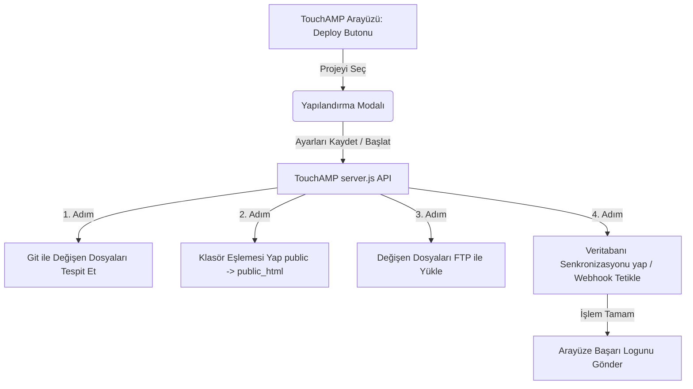

# TouchAMP - Otomatik Dağıtım (Auto-Deploy) & Veritabanı Senkronizasyon Sistemi
## Teknik Uygulama Planı (Implementation Plan)

Bu plan, **TouchAMP Local Development Environment** uygulamasına, projelerin yerel dosyalarını ve veritabanı şemalarını paylaşımlı hostinglere (cPanel vb.) tek tıkla güvenle yükleyen, sadece değişen dosyaları FTP/SFTP üzerinden senkronize eden ve veritabanı yapılarını bozmadan güncelleyen entegre bir **Auto-Deploy** sistemi eklemeyi amaçlamaktadır.

---

## 1. Mimari Tasarım ve Akış

Sistem, TouchAMP'in Electron/Node.js tabanlı sunucu (`server.js`) ve Express-HTML/JS tabanlı yerel yönetim arayüzü (`app.js` / `index.html`) üzerinden çalışacaktır.

---

## 2. Arayüz Bileşenleri (Frontend - HTML / JS)

### 2.1. `index.html` Değişiklikleri
* Projeler listesindeki her bir projenin yanına şık bir **"Dağıt (Deploy)"** butonu (`button.btn-deploy`) eklenecektir.
* Tıklandığında açılan, premium koyu/altın temaya uygun bir glassmorphism **Deploy Configuration Modal** tasarımı:
  * **Sunucu Bağlantısı:** Sunucu Adresi, FTP Port, Kullanıcı Adı, Şifre.
  * **Dizin Eşleşmeleri:** 
    * Proje Kök Dizin Hedefi (örn: `/noykozmetik`)
    * Public Dizin Hedefi (örn: `/public_html`)
  * **Veritabanı Bağlantısı:** Uzak Veritabanı Sunucusu, Port, DB Adı, Kullanıcı Adı, Şifre.
  * **Ignore List (Yoksayma Listesi):** Varsayılan olarak `.env`, `.git`, `node_modules`, `storage`, `public/storage` içeren düzenlenebilir bir Textarea.
  * **Log Ekranı:** Dağıtım esnasında sunucudan gelen canlı logları (yüklenen dosyalar, yapılan işlemler) terminal stilinde akıtan bir konsol ekranı.

### 2.2. `app.js` Geliştirmeleri
* Deploy butonuna tıklandığında projenin önceden kaydedilmiş deploy ayarlarını getiren API çağrısı.
* Ayarları `sources.json` veya yeni bir `deploy_configs.json` içinde kalıcı kılacak kaydetme fonksiyonu.
* Dağıtım işlemini başlatan ve canlı log akışını (Server-Sent Events veya Chunked Stream kullanarak) konsola yazdıran asenkron döngü.

---

## 3. Arka Plan Sunucu Servisi (Backend - `server.js`)

Yeni eklenecek olan `/api/deploy/:project` uç noktası (endpoint) şu adımları sırayla işleyecektir:

### 3.1. Adım 1: Sadece Değişen Dosyaların Tespiti
* TouchAMP yerel sunucusunda `child_process.exec` kullanarak proje dizininde Git kontrolü yapar:
  * Değişen dosyalar: `git diff --name-only`
  * Yeni eklenen dosyalar: `git status --porcelain`
* Eğer projede Git kurulu değilse yedek plan olarak: Dosyaların son değiştirilme tarihleri (file modification times) yerel bir log dosyasıyla (`.touchamp-deploy-state`) karşılaştırılarak tespit edilir.

### 3.2. Adım 2: Dizin Haritalaması ve Filtreleme
* Tespit edilen dosyalar, ignore listesindeki kurallarla karşılaştırılarak filtrelenir.
* Filtrelenen dosyaların sunucudaki yükleme yolları dinamik olarak hesaplanır:
  * Dosya `public/` içindeyse ➔ Sunucudaki `public_html/` hedefine yönlendirilir.
  * Dosya dışarıdaki diğer klasörlerdeyse (örn: `app/`) ➔ Sunucudaki `noykozmetik/` (kök dizin) hedefine yönlendirilir.

### 3.3. Adım 3: FTP / SFTP ile Senkronizasyon
* TouchAMP'e hafif ve popüler bir kütüphane olan `basic-ftp` dahil edilerek güvenli bağlantı kurulur.
* Sadece filtrelenmiş değişen dosyalar sunucuya yüklenir. Klasör yapıları sunucuda yoksa otomatik oluşturulur.
* Sunucudaki mevcut `storage` symlink yapısının bozulmaması için klasörler silinmez, sadece dosyalar tek tek güncellenir.

### 3.4. Adım 4: Veritabanı Yapı Değişikliklerinin (Schema) Güncellenmesi

Veritabanı güncellemelerini iki güvenli seçenekle yönetebiliriz (Ayarlardan seçilebilir olacaktır):

#### Seçenek A: Laravel Webhook Tetikleme (En Güvenlisi - Sıfır Risk)
* TouchAMP, dosya yükleme işlemi tamamlandığında uzak sunucuya güvenli bir HTTP isteği gönderir:
  `GET https://domain.com/api/secure-migrate?token=TouchAMP_Secret_Token`
* Bu istek sunucu tarafında `Artisan::call('migrate')` komutunu tetikler. Yeni eklenen migration dosyaları sırayla çalışır.
* **Avantajı:** İsim değişikliklerinde (column rename) veri kaybı riski sıfırdır.

#### Seçenek B: TouchAMP Doğrudan MySQL Sync (Şemasız Dağıtım)
* TouchAMP, yerel MySQL (`localhost`) ve uzak MySQL bağlantılarını açar.
* Tablo yapılarını karşılaştırır:
  * Yerelde olup canlıda olmayan kolonları tespit eder ➔ `ALTER TABLE ... ADD COLUMN ...` sorgusu ile uzak sunucuya ekler. Eski veriler tamamen korunur, yeni alan `NULL` olur.
  * Yerelde silinmiş kolonları tespit eder ➔ `ALTER TABLE ... DROP COLUMN ...` sorgusu ile uzak sunucudan siler. Diğer kolonların verilerine dokunmaz.
  * Kolon tipi genişletildiyse ➔ `ALTER TABLE ... MODIFY COLUMN ...` ile günceller.
* **Avantajı:** Laravel dışındaki (Wordpress, özel PHP vb.) tüm projelerde de şemasız çalışır.

---

## 4. Kullanıcı Deneyimi ve Emniyet Tedbirleri

* **Ön İzleme (Dry Run):** "Deploy" butonuna basılmadan önce "Neler Yüklenecek?" listesi çıkarılır. Kullanıcı hangi dosyaların gideceğini ve hangi tabloların güncelleneceğini onaylar.
* **Geri Alma Noktası (DB Backup):** Veritabanı senkronizasyonu başlamadan hemen önce TouchAMP otomatik olarak uzak veritabanının bir `.sql` yedeğini alıp `backups/` klasörüne kaydeder. Bir terslik durumunda eski yapı anında geri yüklenebilir.
* **Bağlantı Güvenliği:** API uç noktası (`restrictToLocal` middleware sayesinde) sadece sizin bilgisayarınızdan gelen isteklere yanıt verir. Dışarıdan hiç kimse bu deploy mekanizmasını tetikleyemez.

---

## 5. Kurulum ve Bağımlılıklar

TouchAMP tarafına eklenecek yeni paketler:
1. `basic-ftp` (Dosya senkronizasyonu için)
2. `mysql2` (Yerel ve uzak MySQL şema analizleri için)

---

> [!TIP]
> **Neden Harika Bir Çözüm?**
> Bu sistem kurulduğunda, normalde 15-20 dakika süren, dikkat gerektiren ve hata payı yüksek olan FTP yüklemeleri ve SQL import süreçleri, yerel geliştirme ortamınızdan **sadece 5 saniye içinde tamamen otomatik ve hatasız** bir şekilde gerçekleştirilecektir.
